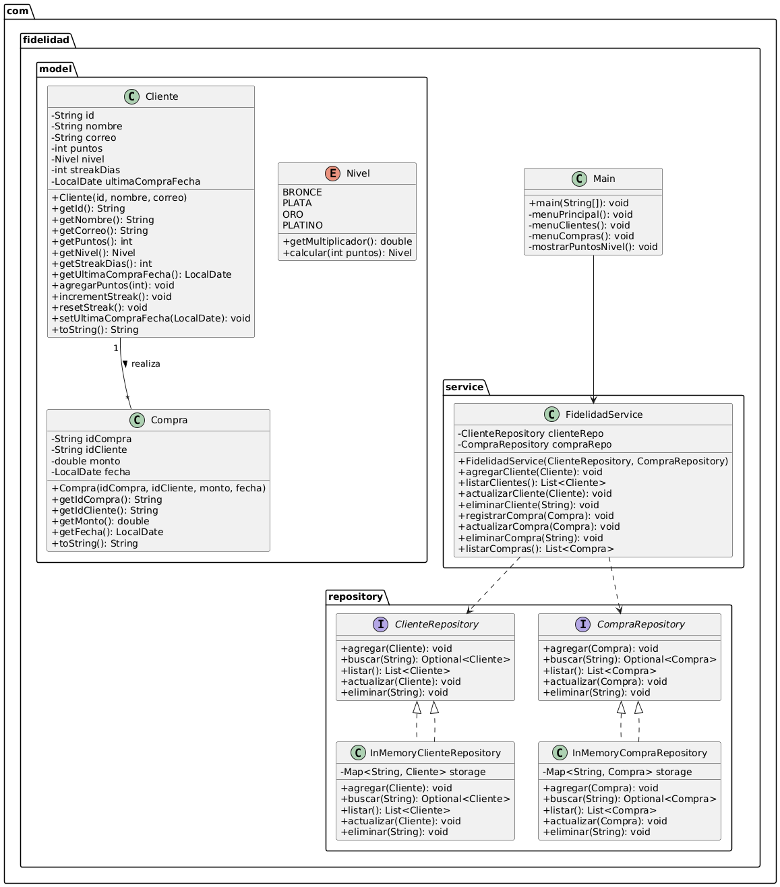
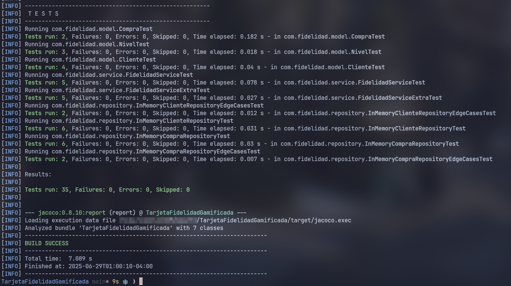

# Tarjeta de Fidelidad Gamificada

## Descripción
Sistema CLI en Java para gestionar clientes, compras y niveles de fidelidad.

## Diseño



## Compilar y ejecutar
```bash
mvn clean package
java -jar target/TarjetaFidelidadGamificada-1.0-SNAPSHOT.jar
```

## Ejecutar tests

```bash
mvn test
```



## Cobertura

He medido principalmente dos tipos de cobertura con JaCoCo:

1. **Cobertura de líneas**

   * Indica el porcentaje de sentencias de código que han sido ejecutadas al menos una vez por los tests.
   * Me ayuda a asegurar que no queden "líneas muertas" sin probar.

2. **Cobertura de ramas**

   * Verifica que en cada estructura de control (ifs, switch, operadores ternarios...) se ejercitan tanto la condición verdadera como la falsa.
   * Garantiza que todos los flujos lógicos incluidos los casos de error y los bonus de negocio están cubiertos.

> **¿Por qué estos dos?**
>
> * La cobertura de líneas ofrece una visión global de cuánto código está siendo probado.
> * La cobertura de ramas añade profundidad, confirmando que no sólo se alcanza cada línea, sino que se validan todos los caminos de decisión.

Con este enfoque obtengo un balance entre **cantidad** (líneas) y **calidad** (ramas) de pruebas, cubriendo las rutas críticas del programa de fidelidad.

## Licencia

MIT

